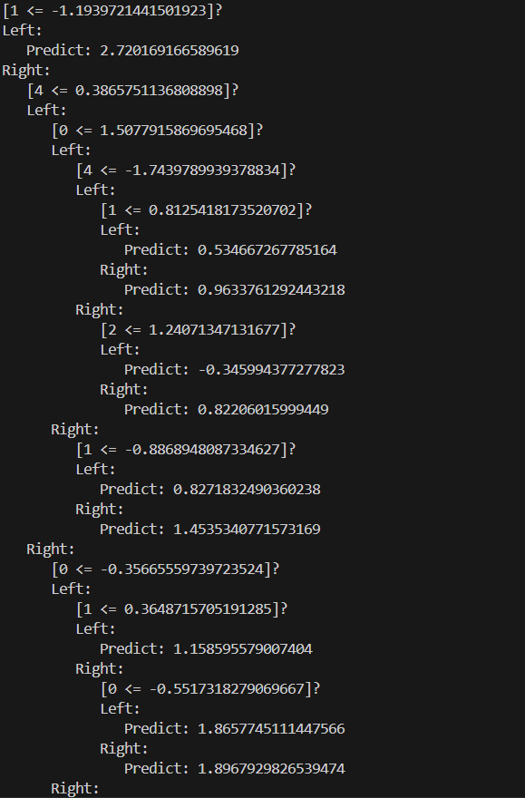
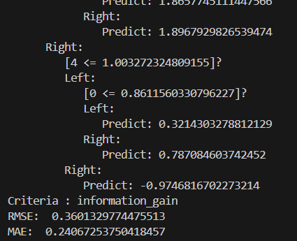
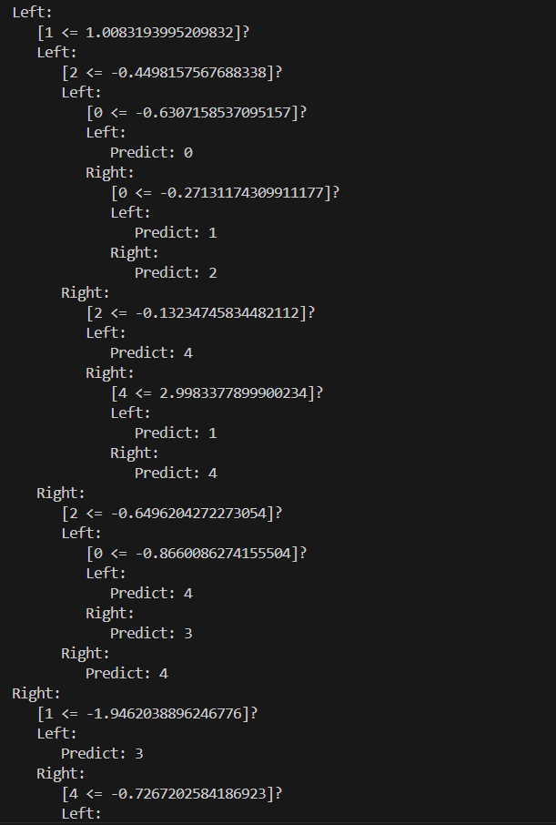
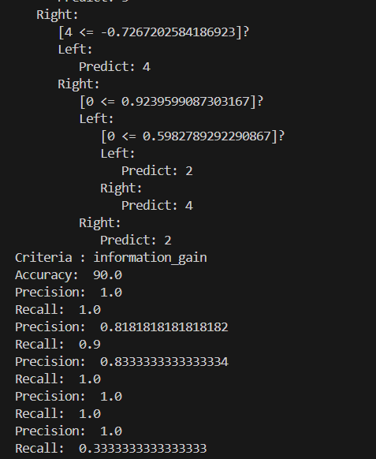
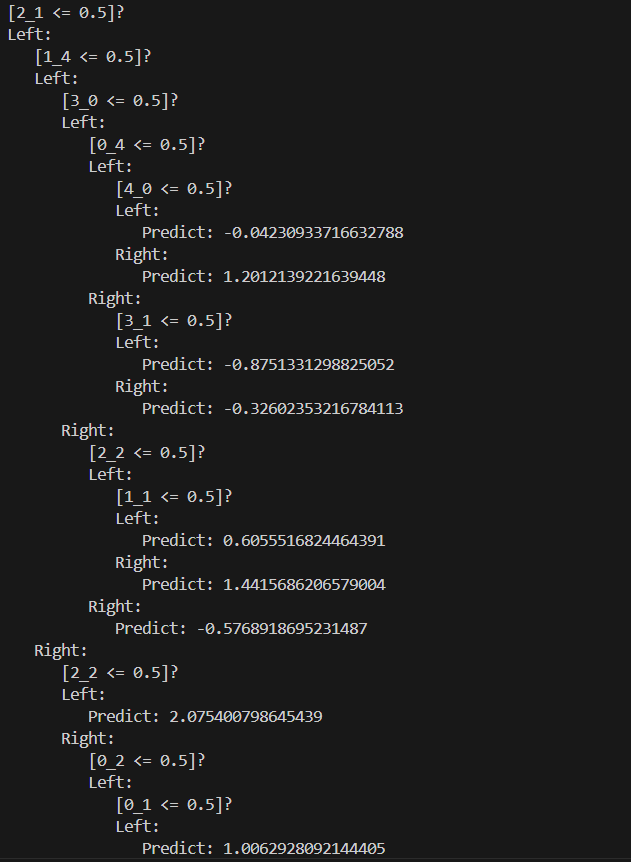
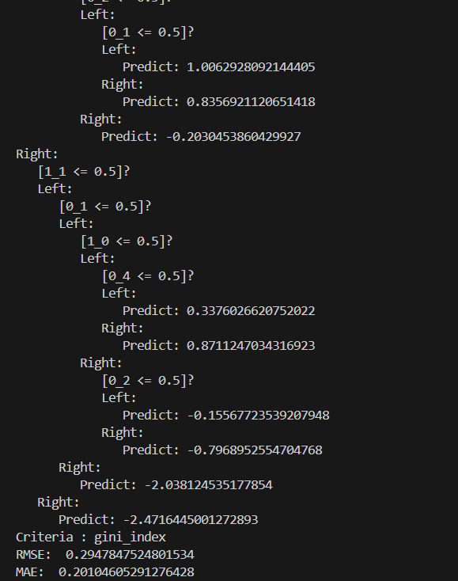
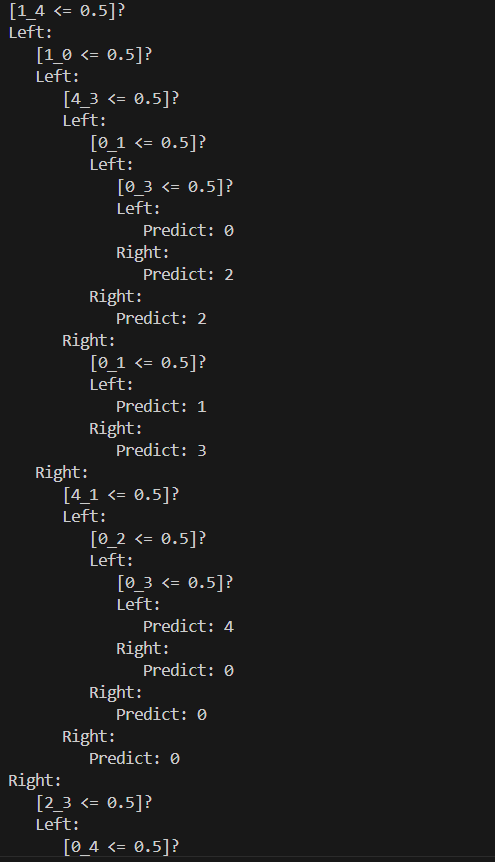
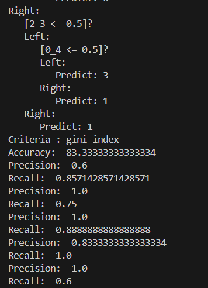

# Q1: Decision Tree Models

We trained decision tree models for four cases.  
The following are the visualizations of the generated trees and their evaluation metrics.

---

## Tree 1 Real Input Real Output

**Performance Metrics:**
- RMSE: `0.360`
- MAE: `0.240`

---

## Tree 2 Real Input Discrete Output

**Performance Metrics:**
- Accuracy: `90.0%`
- Precision:
  - Class 0: `1.0`
  - Class 1: `1.0`
  - Class 2: `0.8181818181818182`
  - Class 3: `0.8333333333333334`
  - Class 4: `0.3333333333333333`
- Recall:
  - Class 0: `1.0`
  - Class 1: `0.9`
  - Class 2: `1.0`
  - Class 3: `1.0`
  - Class 4: `1.0`

## Tree 3 Discrete Input Real Output

**Performance Metrics:**
- RMSE: `0.294`
- MAE: `0.201`

## Tree 4 Discrete Input Discrete Output

**Performance Metrics:**
- Accuracy: `83.33%`
- Precision:
  - Class 0: `0.6`
  - Class 1: `1.0`
  - Class 2: `1.0`
  - Class 3: `0.83`
  - Class 4: `1.-`
- Recall:
  - Class 0: `0.85`
  - Class 1: `0.75`
  - Class 2: `0.88`
  - Class 3: `1.0`
  - Class 4: `0.6`
---

