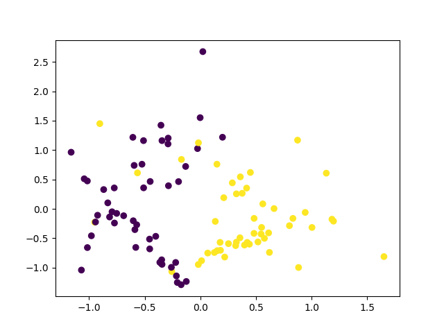
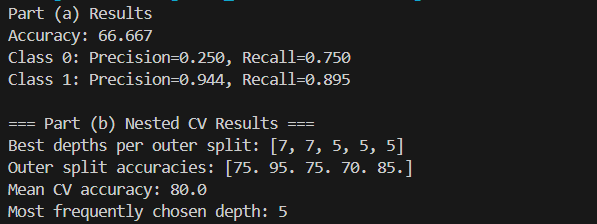

# Q2 Results

## Dataset Visualisation

## Part (a) Results
The model achieved an overall accuracy of **66.67%**.  
The class-wise performance shows some imbalance:

- **Class 0**: Precision = 0.250, Recall = 0.750  
- **Class 1**: Precision = 0.944, Recall = 0.895  

This indicates that the model performs much better in identifying **Class 1**, but struggles with **Class 0** (high recall but low precision).

---

## Part (b) Nested Cross-Validation Results
Nested cross-validation was performed to evaluate the generalization of the decision tree depth:

- **Best depths per outer split**: [7, 7, 5, 5, 5]  
- **Outer split accuracies**: [75, 95, 75, 70, 85]  
- **Mean CV accuracy**: **80.0%**  
- **Most frequently chosen depth**: **5**

These results suggest that a depth of 5 provides the most stable and effective trade-off, though in some cases a deeper tree (7) performed better.

---

