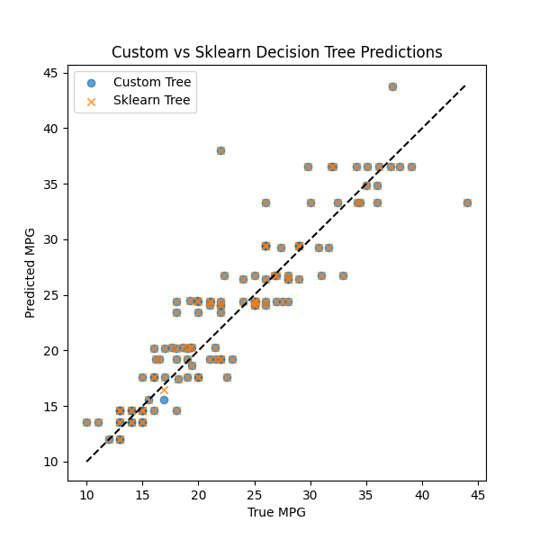
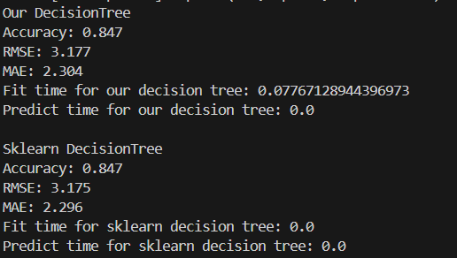

# Q3: Decision Tree Regression – Custom vs Sklearn

## Results

We implemented and compared our custom implementation of Decision Tree with Scikit-learn’s implementation on the MPG dataset.  
The comparison includes **Accuracy, RMSE, MAE, and training/prediction times**.

### Performance Metrics

**Our Decision Tree**
- Accuracy: **0.847**
- RMSE: **3.177**
- MAE: **2.304**
- Fit time: **0.078 s**
- Predict time: **0.0 s**

**Sklearn Decision Tree**
- Accuracy: **0.847**
- RMSE: **3.175**
- MAE: **2.296**
- Fit time: **0.0 s**
- Predict time: **0.0 s**

Both models achieve nearly identical results in terms of accuracy and error metrics.  
The small difference in fit time is due to the efficiency of the optimized sklearn library.

---

## Visual Comparison

Below is a scatter plot of predicted vs true MPG values for both implementations:

The black dashed line represents the ideal fit (`y = x`). Both the custom and sklearn trees align closely with this line, showing similar predictive performance.

---

## Output Logs

For reference, the execution logs are shown below:

---

## Conclusion

Our custom Decision Tree performs on par with sklearn’s implementation in terms of prediction quality.  
The sklearn version is significantly faster due to its C-level optimizations, but the custom version demonstrates correctness and a solid understanding of the algorithm’s working.
