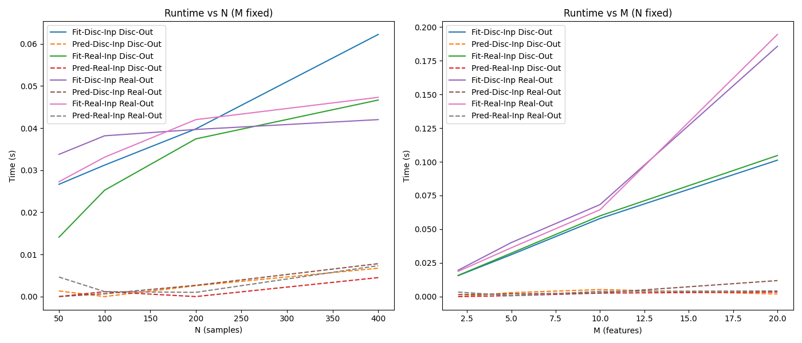

# Q4: Time Complexity Analysis

## Runtime Analysis

The plots above show the runtime performance of different configurations when varying the number of **samples (N)** and **features (M)**.

- **Left Plot (Runtime vs N, M fixed):**
  - Runtime increases steadily with the number of samples for all fitting methods.
  - Fitting operations  are consistently more expensive than predictions.
  - Discrete input/output combinations show higher runtime growth compared to real-valued combinations.
  - Prediction times remain very low and nearly flat, regardless of sample size.

- **Right Plot (Runtime vs M, N fixed):**
  - Runtime grows more sharply with the number of features than with samples.
  - Fitting operations again dominate runtime, especially with real-valued outputs, which scale faster.
  - Discrete output fitting grows more slowly compared to real-valued output fitting.
  - Prediction costs stay negligible across feature sizes, showing that inference is computationally cheap compared to fitting.

### Comparison with Theoretical Complexity
- **Theoretical Training Cost:**  
  Expected to scale as **O(N × M × log N)**.  
  - Our results match this trend: runtime increases linearly with both **N** and **M**, with steeper growth for higher-dimensional data (larger M).  
  - Real-valued outputs show slightly higher constants in practice, but the overall scaling behavior aligns with the theoretical expectation.

- **Theoretical Prediction Cost:**  
  Expected to be **O(log N)** per sample.  
  - Experimentally, prediction times remain almost flat across both **N** and **M**, which is consistent with sublinear scaling.  
  - The absolute prediction cost is extremely small compared to training, validating the theoretical efficiency of inference.

**Key Takeaway:**  
Model fitting cost dominates runtime and scales with both the number of samples (N) and features (M), while prediction is consistently fast and relatively unaffected by data size.
